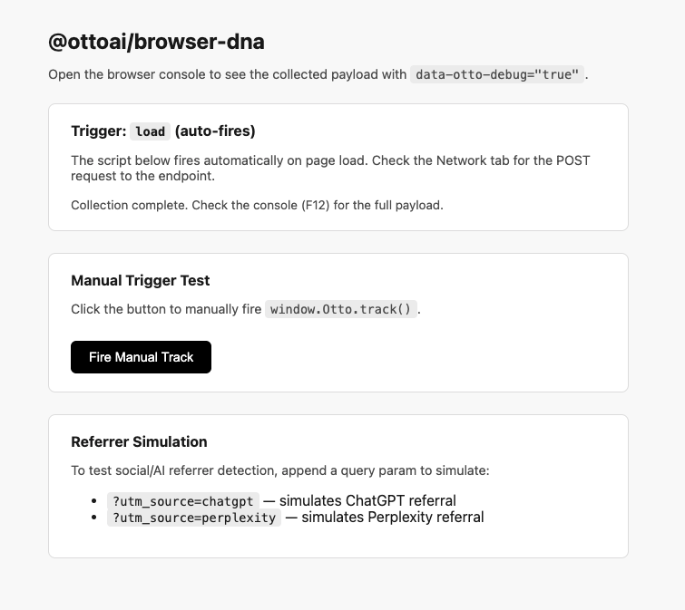

# @ottoai/browser-dna

> **One script. Complete visitor intelligence. You own the data.**

[](https://www.npmjs.com/package/@ottoai/browser-dna)
[](https://opensource.org/licenses/MIT)
[](https://github.com/ottoai/browser-dna)
[](https://www.npmjs.com/package/@ottoai/browser-dna)



Drop-in browser intelligence for any website. Collect visitor identity, device, behavior, creator, and AI signals in a single payload.

No API key. No automatic network requests. No storage writes. Call `scan()`, get data, do whatever you want with it.

Works as a **`<script>` tag** (drop on any site, zero setup) or as an **npm/ESM package** (tree-shakeable, TypeScript-friendly).

---

## Table of Contents

- [Quick Start](#quick-start)
- [Script Tag Embed](#script-tag-embed)
- [npm / ESM Usage](#npm--esm-usage)
- [Signals Collected](#signals-collected)
- [Payload Shape](#payload-shape)
- [Creator Score](#creator-score)
- [Config Reference](#config-reference)
- [Individual Collectors](#individual-collectors)
- [Build](#build)
- [Security & Privacy](#security--privacy)
- [Contributing](#contributing)

---

## Quick Start

### Option A — Script tag (fastest, zero install)

```html
<script src="https://unpkg.com/@ottoai/browser-dna/dist/browser-dna.js"></script>

<script>
  window.BrowserDNA.ready(data => {
    console.log(data.creatorScore)
    // do whatever you want with data
  })
</script>
```

### Option B — npm package

```bash
npm install @ottoai/browser-dna
```

```js
import { scan } from '@ottoai/browser-dna'

const data = await scan()

console.log(data.creatorScore)   // { score: 72, tier: 'active', reasons: [...] }
console.log(data.device.browser) // 'chrome'
console.log(data.social)         // { inAppBrowser: null, referrer: { platform: 'Twitter/X', ... } }
```

---

## Script Tag Embed

```html
<script
  src="https://unpkg.com/@ottoai/browser-dna/dist/browser-dna.js"
  data-trigger="load"
  data-debug="false"
></script>
```

### Receiving the data

```js
// Callback — fires as soon as collection completes
window.BrowserDNA.ready(data => {
  console.log(data)
})

// Manual scan — returns a promise
const data = await window.BrowserDNA.scan()
```

### Triggers

| `data-trigger`     | Behavior |
|--------------------|----------|
| `load` *(default)* | Fires once when the page loads |
| `pageview`         | Fires on load + every SPA navigation (pushState / replaceState / popstate) |
| `manual`           | Does not fire automatically — call `window.BrowserDNA.scan()` yourself |

---

## npm / ESM Usage

### `scan(options?)` — collect all signals, return payload

```js
import { scan } from '@ottoai/browser-dna'

const data = await scan()
// data.fingerprint, data.device, data.social, data.ai, data.creator, ...

// With debug logging
const data = await scan({ debug: true })
```

---

## Signals Collected

### `social` — Social platform signals

- `inAppBrowser` — detect Facebook, Instagram, TikTok, LinkedIn, Snapchat, WhatsApp, Pinterest, Telegram from UA string
- `referrer.platform` — map `document.referrer` hostname to platform (Twitter/X, Facebook, LinkedIn, Reddit, Discord, YouTube, WhatsApp, Telegram, and 30+ more)
- `referrer.raw` — original referrer URL

### `ai` — AI tool signals

- `referrer` — detect ChatGPT, Claude, Perplexity, Gemini, Copilot, Grok, Meta AI, You.com, Phind, Poe from referrer + `utm_source`
- `extensions` — detected AI browser extensions via window globals and DOM selectors

### `extensions` — Browser extension detection

- Scans for 20+ known extensions: AI assistants, creator tools (vidIQ, TubeBuddy, Loom), productivity tools
- Detection via window globals and DOM selectors (MV3-compatible)

### `fingerprint` — Visitor identity

- `id` — stable ThumbmarkJS fingerprint hash (~90% accuracy, MIT)

### `device` — Device and browser signals

- `browser`, `browserVersion`, `os` — parsed from UA string
- `isBot`, `isWebView`, `isInAppBrowser`
- `ip`, `country`, `city`, `region`, `org` — IP geolocation via ipapi.co
- `timezone`, `language`, `userAgent`, `screen`, `deviceMemory`, `cpuCores`, `connection`

### `hardware` — Hardware-tier signals

- `gpu`, `gpuVendor`, `gpuTier` — WebGL renderer + tier
- `displayType` — ultrawide, 4k-retina, retina-laptop, tablet, mobile
- `audioInputs`, `videoInputs`, `hasProAudio`, `hasProVideo`
- `sampleRate`, `maxChannelCount`, `baseLatency`, `audioTier` — AudioContext signals
- `p3ColorGamut`, `hdrDisplay`, `darkMode` — CSS media query signals
- `fonts` — canvas-detected fonts by category (adobe-suite, premium-fonts, developer, system)
- `micPermission`, `cameraPermission`, `hasRecordingAccess` — Permissions API

### `creator` — Creator platform signals

- `referrer` — 50+ creator platforms: YouTube Studio, Substack, Beehiiv, Gumroad, Stan Store, Patreon, Linktree, Beacons, etc.
- `linkInBio` — detected link-in-bio platform
- `utmSignals` — UTM parameter analysis with creator channel inference
- `tier` — inferred creator tier (monetized, active-creator, has-newsletter, beginner)
- `storageArtifacts` — localStorage keys from creator tools (vidIQ, TubeBuddy, Loom, etc.)

### `engagement` — Page behavior

- `scrollDepth` — max scroll percentage (0–100)
- `timeOnPage`, `activeTime` — total and active time in seconds
- `tabWasHidden`, `sessionHour`, `sessionDay`

---

## Payload Shape

```json
{
  "url": "https://yoursite.com/pricing",
  "timestamp": "2026-04-24T10:00:00Z",
  "fingerprint": { "id": "abc123def456" },
  "creatorScore": {
    "score": 72,
    "tier": "active",
    "reasons": ["YouTube Studio referrer", "vidIQ detected", "Pro audio interface"]
  },
  "social": {
    "inAppBrowser": null,
    "referrer": { "platform": "Twitter/X", "raw": "https://t.co/xyz" }
  },
  "ai": {
    "referrer": "ChatGPT",
    "extensions": [{ "name": "Claude Extension", "vendor": "Anthropic", "method": "global" }]
  },
  "extensions": [
    { "name": "vidIQ", "vendor": "vidIQ", "method": "global" }
  ],
  "device": {
    "browser": "chrome",
    "browserVersion": "124.0.0",
    "os": "macos",
    "isBot": false,
    "ip": "41.x.x.x",
    "country": "Nigeria",
    "city": "Lagos",
    "timezone": "Africa/Lagos",
    "language": "en-US",
    "screen": "1440x900",
    "deviceMemory": 8,
    "cpuCores": 8,
    "connection": "4g"
  },
  "hardware": {
    "gpu": "Apple M2",
    "gpuTier": "apple-silicon",
    "displayType": "retina-laptop",
    "hasProAudio": true,
    "audioTier": "pro",
    "p3ColorGamut": true,
    "darkMode": true,
    "hasRecordingAccess": true
  },
  "creator": {
    "referrer": { "platform": "YouTube Studio", "type": "video", "tier": "pro" },
    "tier": "active-creator",
    "storageArtifacts": [{ "tool": "vidIQ", "confidence": "high" }]
  },
  "engagement": {
    "scrollDepth": 68,
    "timeOnPage": 42,
    "activeTime": 31,
    "tabWasHidden": false,
    "sessionHour": 10,
    "sessionDay": "Thursday"
  }
}
```

---

## Creator Score

`creatorScore` is a 0–100 score ranking how likely a visitor is a professional creator or influencer.

| Range | Tier | Description |
|-------|------|-------------|
| 75–100 | `pro` | Strong creator signals — pro tools, creator platform referrer, recording access |
| 50–74 | `active` | Active creator signals — creator tools, content platform referrers |
| 25–49 | `aspiring` | Some creator signals — social referrers, content consumption behavior |
| 0–24 | `consumer` | General visitor — minimal or no creator signals |

### High-confidence signals

| Signal | Points |
|--------|--------|
| YouTube Studio referrer | +20 |
| vidIQ or TubeBuddy detected | +20 |
| Pro audio interface (AudioContext) | +15 |
| Recording access granted (Permissions API) | +12 |
| Creator platform referrer (Substack, Gumroad, etc.) | +10 |
| Creator tool localStorage artifact | +10 |
| Loom extension detected | +8 |

---

## Config Reference

### Script tag attributes

| Attribute | Default | Description |
|-----------|---------|-------------|
| `data-trigger` | `load` | `load`, `pageview`, or `manual` |
| `data-debug` | `false` | Log full payload to browser console |

### `scan(options)`

| Option | Default | Description |
|--------|---------|-------------|
| `debug` | `false` | Log payload to console |

---

## Individual Collectors

Import only what you need for tree-shaking:

```js
import { getSocialSignals }      from '@ottoai/browser-dna'
import { getAISignals }          from '@ottoai/browser-dna'
import { getDeviceSignals }      from '@ottoai/browser-dna'
import { getFingerprintSignals } from '@ottoai/browser-dna'
import { getExtensionSignals }   from '@ottoai/browser-dna'
import { getCreatorSignals }     from '@ottoai/browser-dna'
import { trackEngagement }       from '@ottoai/browser-dna'
import { getHardwareSignals }    from '@ottoai/browser-dna'
import { computeCreatorScore }   from '@ottoai/browser-dna'
```

---

## Build

```bash
npm install
npm run build   # builds both outputs
npm run dev     # watch mode
```

### Outputs

| File | Format | Use |
|------|--------|-----|
| `dist/browser-dna.js` | IIFE (`BrowserDNA` global) | `<script>` tag embed |
| `dist/browser-dna.esm.js` | ESM | npm / bundler import |

- Bundler: [esbuild](https://esbuild.github.io/)
- Target: ES2018 (IIFE) / ES2020 (ESM)
- No runtime dependencies except [ThumbmarkJS](https://github.com/thumbmarkjs/thumbmarkjs) (MIT, bundled in)

### Testing locally

```bash
npx serve .
# Open http://localhost:3000/test.html
```

Enable `data-debug="true"` to log the full payload to the console.

---

## File Structure

```
services/CookieReader/
├── src/
│   ├── index.js         # IIFE browser entry — exposes window.BrowserDNA
│   ├── npm.js           # ESM entry — re-exports scan and all collectors
│   ├── core.js          # scan() implementation
│   ├── social.js        # In-app browser + social referrer detection
│   ├── ai.js            # AI tool referrer + extension detection
│   ├── extensions.js    # Browser extension registry + detection
│   ├── device.js        # IP geo, UA parsing, navigator signals
│   ├── fingerprint.js   # ThumbmarkJS visitorId
│   ├── hardware.js      # GPU, display, audio, fonts, permissions
│   ├── creator.js       # Creator platform referrers, UTM, tool artifacts
│   ├── engagement.js    # Scroll depth, time on page, session signals
│   └── score.js         # Creator score (0–100) + tier
├── dist/
│   ├── browser-dna.js       # Minified IIFE build
│   └── browser-dna.esm.js   # ESM build
├── build.cjs
├── package.json
└── index.html           # Browser test page
```

---

## Security & Privacy

**What data is collected**
`@ottoai/browser-dna` collects publicly available browser signals — UA string, referrer, screen size, IP geolocation, and behavioral signals. It does not collect passwords, form contents, clipboard data, or any PII beyond what is passively available to any web page.

**No storage side effects**
The library does not write to `localStorage`, `sessionStorage`, or cookies. Every `scan()` call is independent and stateless.

**No network requests**
`scan()` makes no network requests. The script tag never POSTs anywhere on its own.

**Third-party dependency**
[ThumbmarkJS](https://github.com/thumbmarkjs/thumbmarkjs) (MIT) is bundled for fingerprinting. It runs entirely client-side and makes no external requests.

**GDPR / CCPA**
Your obligations depend on what you do with the data after calling `scan()`. The library itself is neutral.

---

## Contributing

Found a bug? Want to add a new signal or platform? Contributions are welcome.

See [CONTRIBUTING.md](CONTRIBUTING.md) for guidelines.

---

## License

[MIT License](LICENSE) — free to use, modify, and embed.

---

*Built by [Otto AI](https://joinotto.com)*
